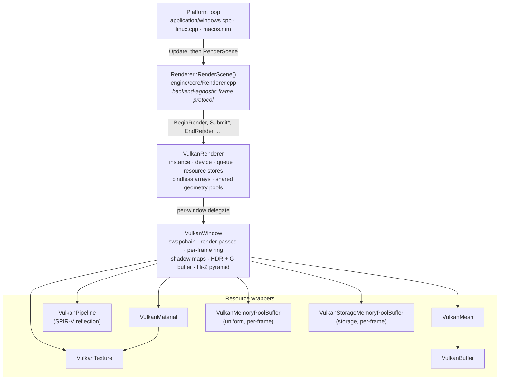
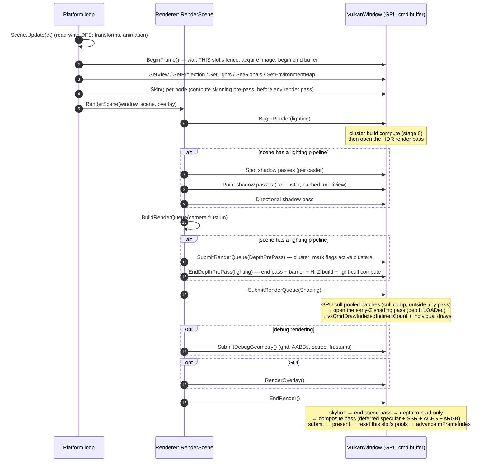
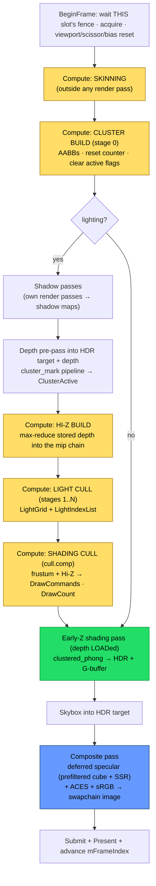
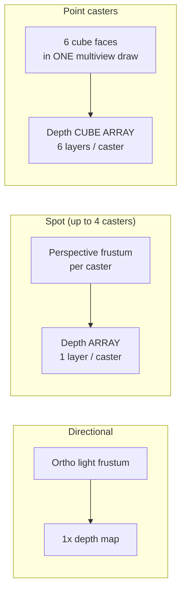
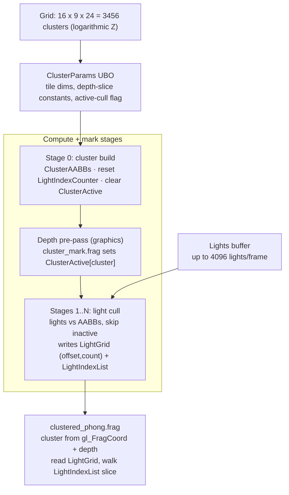
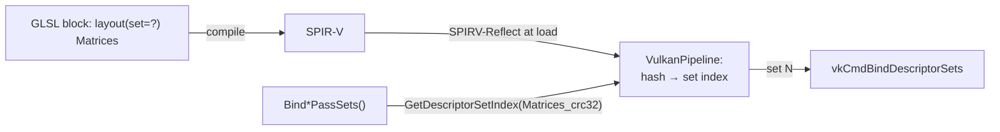

# AeonEngine — Vulkan Render Pipeline

A detailed walkthrough of how a single frame is turned into pixels by the Vulkan
backend, with diagrams, a step‑by‑step description of every pass, and an
architectural assessment at the end.

> Scope: this document describes the **runtime rendering path** (per‑frame command
> recording), not resource loading (mesh/texture/pipeline upload) except where it
> intersects the frame. Code lives under
> [engine/renderers/vulkan/](.) with the backend‑agnostic
> orchestration in [engine/core/Renderer.cpp](../../core/Renderer.cpp).

---

## 1. Big picture

AeonEngine implements a **clustered forward (Forward+) renderer with a deferred
specular composite**:

- **Compute light clustering** — the view frustum is diced into a 3D grid of
  clusters; a compute pass culls up to 4096 lights into per‑cluster lists so the
  fragment shader only shades the lights that touch its cluster.
- **A depth pre‑pass that marks active clusters** — only clusters that actually
  contain visible geometry are considered by light culling. Its depth is *kept*:
  the shading pass loads it for early‑Z and a compute reduce turns it into a Hi‑Z
  pyramid.
- **GPU‑driven culling for static geometry** — static indexed meshes live in
  shared vertex/index pools; `cull.comp` frustum‑ and Hi‑Z‑occlusion‑culls their
  instances into a compacted command list drawn with a single
  `vkCmdDrawIndexedIndirectCount`.
- **Bindless materials and textures** — one global combined‑image‑sampler array
  plus a material storage buffer reached through a buffer‑device‑address push
  constant, so one indirect draw can shade meshes with different materials.
- **Shadow mapping for all three light types** — directional (single map), spot
  (texture array, one layer per caster), and point (cube‑map array, six faces per
  caster rendered in one multiview pass).
- **HDR rendering + composite/tone map** — the scene renders into an `RGBA16F`
  target plus a two‑attachment G‑buffer (view normal + roughness, pre‑integrated
  specular weight); a fullscreen pass adds the deferred specular reflection, then
  applies exposure + ACES tone mapping + sRGB encode when resolving to the
  swapchain.
- **Image‑based lighting + screen‑space reflections** — an HDR environment is
  drawn as a skybox and GGX‑prefiltered into a cube map; the composite mixes that
  reflection with SSR marched against the kept scene depth.
- **Compute skinning** — skeletal meshes are skinned by a compute pre‑pass into
  transient vertex buffers before any geometry pass runs.
- **Three frames in flight** — command buffers, transient pools, render targets
  and per‑frame descriptor sets are ringed `kFramesInFlight` deep
  ([MemoryPoolBuffer.hpp](../../../include/aeongames/MemoryPoolBuffer.hpp)) so the
  CPU does not stall on the GPU every frame.

The same **per‑frame protocol** drives both the Vulkan and OpenGL backends; it is
written once in [engine/core/Renderer.cpp](../../core/Renderer.cpp) as an ordered
sequence of primitive steps that each backend implements.

---

## 2. Architectural layers

| Layer | Responsibility |
| --- | --- |
| `Renderer` (abstract) | Declares the frame protocol; owns the non‑virtual `RenderScene` that sequences it. See [include/aeongames/Renderer.hpp](../../../include/aeongames/Renderer.hpp). |
| `VulkanRenderer` | Owns `VkInstance`/`VkDevice`/`VkQueue`, the debug messenger, the descriptor‑set‑layout cache, single‑time command helpers, the **global bindless** texture array + material buffer, the **shared geometry pools** (per‑stride vertex pool + one uint32 index pool), device‑loss detection/recovery, and the four **resource stores** (`mMeshStore`, `mPipelineStore`, `mMaterialStore`, `mTextureStore`) plus the `mWindowStore`. |
| `VulkanWindow` | Everything per‑surface: swapchain, the pre‑pass/shading/shadow/tonemap render passes, framebuffers, the per‑frame ring of command buffers, uniform/storage pools, HDR + G‑buffer + depth targets and the Hi‑Z pyramid, all shadow maps, IBL images, and **all command recording** for passes and draws. |
| Resource wrappers | Thin RAII types translating engine resources into Vulkan objects. `VulkanPipeline` additionally performs **SPIR‑V reflection** to discover descriptor sets, vertex attributes and push‑constant ranges. |

Resources are cached by a `size_t` key in `std::unordered_map` stores on the
renderer; `GetVulkanPipeline`/`GetVulkanMaterial`/`GetVulkanMesh` return the cached
wrapper, creating it on first use. Pipelines are additionally keyed per **render
pass** (the depth pre‑pass, early‑Z shading and point‑shadow multiview passes each
need a distinct pipeline object).

Anything whose lifetime spans a submitted frame is **ringed `kFramesInFlight`
(= 3) deep** and indexed by `mFrameIndex`: command pools/buffers, uniform and
storage pools, depth + HDR + G‑buffer images, the Hi‑Z pyramid, shadow maps, and
the `Matrices`/`Lights`/`ClusterParams`/`Globals`/`*ShadowParams` descriptor sets.
`BeginFrame` repoints the window's "current" aliases at the active slot so the
pass binders stay index‑agnostic.

---

## 3. The per‑frame protocol

Everything below happens inside **one command buffer** — this frame slot's ring
entry — recorded from scratch each frame and submitted once. The orchestration
lives in `Renderer::RenderScene`.

### Command‑buffer timeline & render targets

> **What the "depth pre‑pass" is for.** It is primarily a *cluster‑marking* pass —
> its fragment shader sets the per‑cluster `ClusterActive` flag so light culling can
> skip clusters with no visible geometry. Its depth is no longer thrown away,
> though: the attachment `STORE`s, the shading pass is a second, render‑pass‑
> compatible pass whose depth attachment `LOAD`s it (so shading gets **early‑Z**
> rejection), and a compute reduce turns it into the **Hi‑Z pyramid** the shading
> cull tests occlusion against. Colour still clears for shading — the pre‑pass only
> wrote throwaway sentinels.

---

## 4. Step‑by‑step frame walkthrough

### Step 0 — CPU: scene update (before the renderer sees anything)
`Scene.Update(dt)` runs a **read‑write** depth‑first sweep that advances animation,
interpolates skeletons, and computes world transforms. A separate **read‑only**
render sweep later collects draw items. (These two sweeps are a deliberate engine
invariant: Update mutates, Render only reads.)

### Step 1 — `BeginFrame`
[VulkanWindow.cpp](VulkanWindow.cpp) `BeginFrame`:

1. Bail out when the device is lost — `VulkanRenderer` rebuilds it at the top of a
   later frame.
2. `vkWaitForFences` on **this frame slot's own fence** (`mVkFences[mFrameIndex]`)
   so the CPU may run up to `kFramesInFlight` frames ahead instead of stalling on
   one global fence.
3. `vkAcquireNextImageKHR`, signalling this slot's acquire semaphore. The image
   index is only known afterwards, which is why acquire semaphores are **per frame
   in flight**, not per image.
4. Swapchain image count and frames in flight need not match, so an
   **images‑in‑flight guard** waits on whichever fence still owns the acquired
   image before reusing it.
5. Point the per‑frame aliases (command buffer plus the `Matrices`, `Lights`,
   `ClusterParams`, `Globals` and `*ShadowParams` descriptor sets) at this slot,
   reset its command pool and `vkBeginCommandBuffer` (one‑time‑submit).
6. Set dynamic viewport, scissor, and **depth bias = 0** for the frame (only the
   shadow passes override bias).

`BeginFrame` is **idempotent** for the frame: the app calls it early to run the
skinning compute phase, and `BeginRender` calls it again as a no‑op.

The app then uploads per‑frame data into this slot's host‑visible UBOs:
`SetViewMatrix`, `SetProjectionMatrix`, `SetLights`, `SetGlobals`,
`SetEnvironmentMap`.

A `VK_ERROR_DEVICE_LOST` from any of these calls (or from submit/present) routes to
`VulkanRenderer::NotifyDeviceLost`; `Renderer::RenderScene` then skips whole frames
while `IsDeviceLost()` holds, so nothing is recorded against dead handles.

### Step 2 — Compute skinning pre‑pass
For each node, `Node::Skin` may call `VulkanWindow::Skin`, which:

- binds the skinning compute pipeline (stage 0),
- binds `SkinningMatrices` (per‑joint `pose × inverse‑bind`, storage pool),
  `SourceVertices` (the mesh's rest‑pose vertex buffer exposed as an SSBO), and
  `SkinnedVertices` (a fresh storage‑pool output allocation),
- dispatches `ceil(vertexCount / 64)` workgroups,
- issues a **compute‑write → vertex‑attribute‑read** barrier so the later draw
  fetches finished data (without it, vertices "explode").

The resulting `SkinnedVertices` accessor is threaded through the render queue and
bound as the **vertex input** in place of the rest pose during the geometry passes.

### Step 3 — `BeginRender` → cluster build
`VulkanWindow::BeginRender(lighting)`:

- Enables active‑cluster culling for the frame and refreshes `ClusterParams`.
- Lazily loads the renderer‑owned `shaders/cluster_mark` pipeline.
- `DispatchClusterBuild` (compute **stage 0**): allocates the five per‑frame
  clustering SSBOs and builds per‑cluster view‑space **AABBs**, zeroes the global
  light‑index **counter**, and clears the per‑cluster **active flags**.
- `Barrier`, then `BeginRenderPass` opens the HDR pass for the upcoming depth
  pre‑pass.

If the scene has **no** lighting pipeline, `BeginRender` instead binds empty,
zeroed light buffers (so the clustered fragment shader safely reads zero lights)
and opens the HDR pass directly.

### Step 4 — Shadow passes (only when lighting is present)
All shadow passes render depth from a light's point of view into a dedicated
shadow map, culling the render queue to the **light's** frustum (not the camera's).
Order matters: **spot → point → directional**, because every shadow depth pass uses
the window's `ShadowParams` matrix as scratch, so the directional pass must write it
**last** to leave the correct matrix in place for shading.

- **Spot** — for each caster: build the queue in the caster's perspective frustum,
  `BeginSpotShadowPass(slot, vp)` (renders into array layer `slot`), submit with
  `RenderPass::ShadowPass`, `EndSpotShadowPass` (transitions that layer to
  sampleable).
- **Point** — omnidirectional, so all six cube faces render in a **single draw**
  via Vulkan **multiview** (one `gl_ViewIndex` per face) into the caster's six
  cube‑map‑array layers. Point maps are **cached**: a caster is only re‑rendered
  when its light (position/radius) or the shadow‑casting geometry signature
  changes, so a static scene renders point shadows once and samples them for free.
- **Directional** — `GetDirectionalShadowMatrix` fits an ortho frustum to the view;
  the queue is culled to it, rendered with a non‑zero slope/constant depth bias to
  fight shadow acne, then `EndShadowPass` transitions the map for sampling.

The renderer‑owned `shadow_depth` (and multiview `point_shadow_depth`) pipelines
**substitute** each item's own pipeline/material during these passes.

### Step 5 — Camera render queue
`Scene::BuildRenderQueue(cameraFrustum)` collects every camera‑visible draw into a
list of `RenderItem`s, sorted so that runs of identical geometry (same mesh +
pipeline + material) are adjacent and can be merged into instanced draws.

### Step 6 — Depth pre‑pass (cluster marking)
`SubmitRenderQueue(DepthPrePass)` replays the camera queue with the `cluster_mark`
pipeline substituted. Its fragment shader computes the cluster for each covered
pixel and sets that cluster's `ClusterActive` flag. Only `Matrices`,
`ClusterParams`, `ClusterActive` (and the per‑object matrices) are bound.

Because the queue is sorted by `(pipeline, material, mesh)`, contiguous runs of
**pooled** items — unskinned, indexed meshes living in the shared geometry pools —
are collapsed by `RenderMultiBatch` into one CPU‑built
`vkCmdDrawIndexedIndirect`: every transform and bindless material index goes into
shared per‑instance buffers and each distinct mesh becomes one indirect command.
Skinned, non‑indexed or privately‑buffered items fall back to individual draws.
The same path serves the shadow passes.

The pre‑pass depth attachment `STORE`s, which is what makes Steps 7 and 8 possible.

### Step 7 — `EndDepthPrePass` → Hi‑Z + light cull
`VulkanWindow::EndDepthPrePass`:

- ends the depth pre‑pass render pass,
- `Barrier` makes the fragment‑written active flags visible to compute,
- `BuildHiZPyramid` transitions the stored scene depth to shader‑read and
  max‑reduces it into the per‑frame Hi‑Z mip chain (an `R32F`,
  `SAMPLED | STORAGE` pyramid at half depth resolution, one `hiz_build.comp`
  dispatch per mip),
- `DispatchLightCull` (compute **stages 1..N**) culls the frame's lights against
  the cluster AABBs — **skipping inactive clusters** — filling `LightGrid` (an
  `(offset, count)` per cluster) and the flat `LightIndexList`, with a barrier
  between stages and after the last one.

It deliberately does **not** reopen a render pass: the shading GPU cull in Step 8
has to run outside one.

### Step 8 — Shading pass (GPU‑driven clustered forward)
`SubmitRenderQueue(Shading)` runs in three phases:

1. **GPU cull, outside any render pass.** Each contiguous run of pooled items
   sharing a pipeline becomes a `GpuCullInstance` array (model matrix, object‑space
   AABB centre/radii, index count, first index, base vertex, bindless material
   index). `CullShadingBatch` uploads it and dispatches `cull.comp`, which
   frustum‑tests each instance and rejects it against the **Hi‑Z pyramid**,
   compacting the survivors into `DrawCommands`, `DrawCount`, `InstanceMatrices`
   and `InstanceMaterials`.
2. **`BarrierComputeToIndirect`**, then `BeginShadingRenderPass` — the early‑Z
   variant whose depth attachment `LOAD`s the pre‑pass result.
3. **Draw.** `DrawCulledShadingBatches` issues one
   `vkCmdDrawIndexedIndirectCount` per batch; skinned, non‑indexed and privately
   buffered items follow as individual draws.

`clustered_phong.frag` reconstructs its cluster from `gl_FragCoord`, looks up its
`LightGrid` cell, iterates just that cell's slice of `LightIndexList`, and
accumulates PBR lighting with the shadow maps. It writes three attachments: linear
HDR colour, plus a G‑buffer of **view normal + roughness** and the pre‑integrated
**specular weight**. The specular *reflection* itself is deliberately deferred to
the composite (Step 9) so it can mix the prefiltered cube map with SSR without
double counting; only the diffuse SH irradiance is added here.

### Step 9 — `EndRender` → skybox, composite, present
`VulkanWindow::EndRender`:

1. If an environment map is set, draw the **skybox** into the still‑open scene
   pass (depth‑tested at the far plane, shaded in linear space).
2. End the scene render pass and transition the scene depth to
   `DEPTH_STENCIL_READ_ONLY_OPTIMAL` so the composite can sample it.
3. Run the **composite / tonemap** render pass: a fullscreen triangle reads the
   HDR colour, both G‑buffer attachments and the scene depth. For glossy pixels it
   marches a **screen‑space reflection** against the depth buffer (binary‑refined,
   edge‑faded, roughness‑blurred) and blends it over the prefiltered cube map
   reflection, scales the result by the specular weight, then applies exposure +
   ACES tone map + sRGB encode into the swapchain image. It binds `Matrices`,
   `Globals` and `PrefilteredEnvironment` at whatever sets it reflected them to.
4. `vkEndCommandBuffer`, reset this slot's fence, `vkQueueSubmit` (wait on the
   slot's acquire semaphore at `COLOR_ATTACHMENT_OUTPUT`, signal the per‑image
   submit semaphore, fence the slot), `vkQueuePresentKHR`.
5. **Reset** this slot's uniform and storage pools, clear `mFrameBegun`, and
   advance `mFrameIndex` to the next ring slot.

---

## 5. Clustered Forward+ in detail

**Per‑frame clustering buffers** (all allocated from the storage pool, in
[VulkanWindow.cpp](VulkanWindow.cpp) `DispatchClusterBuild`):

| Buffer (CRC binding) | Contents |
| --- | --- |
| `ClusterAABBs` | Per‑cluster view‑space AABB (built stage 0). |
| `LightGrid` | Per‑cluster `(offset, count)` into `LightIndexList`. |
| `LightIndexList` | Flat light indices; capacity `CLUSTER_COUNT × 32`. |
| `LightIndexCounter` | Global atomic allocator for `LightIndexList`. |
| `ClusterActive` | Per‑cluster visible flag (mark pass writes, cull reads). |

Key constants (from [include/aeongames/GpuClusterParams.hpp](../../../include/aeongames/GpuClusterParams.hpp)
and [include/aeongames/GpuLight.hpp](../../../include/aeongames/GpuLight.hpp)):
`CLUSTER_GRID = 16×9×24`, `CLUSTER_COUNT = 3456`, `MAX_LIGHTS_PER_CLUSTER = 128`,
`LIGHT_INDEX_LIST_CAPACITY = CLUSTER_COUNT × 32`, `MAX_LIGHTS_PER_FRAME = 4096`.
Clustering compute uses `local_size_x = 64`, so each dispatch is
`ceil(CLUSTER_COUNT / 64)` workgroups.

The lighting "pipeline" is a **compute** `Pipeline` resource whose ordered stages
are `lighting.0.comp` (cluster build) and `lighting.1.comp` (light cull);
`GetComputeStageCount` drives the cull loop.

---

## 6. Descriptor‑set model

Descriptor sets are identified **by name**, not by a hardcoded index. Each engine
resource block has a stable `CRC32` hash in
`Mesh::BindingLocations` (e.g. `"Matrices"_crc32`, `"LightGrid"_crc32`). At load
time, `VulkanPipeline` uses **SPIR‑V reflection** to record, for every shader, the
mapping *hash → set index*. Draw code then asks
`GetDescriptorSetIndex(hash)` and binds the engine's set at **whatever index the
shader happened to declare** (or skips it if the shader doesn't use it).

This makes binding **resilient to shader layout changes** and lets one C++ path
serve many shader variants. Three per‑pass binders keep the set list in one place:

- `BindShadingPassSets` — matrices, lights, cluster params, globals, light grid,
  light index list, all shadow params/maps, prefiltered environment, and the
  renderer‑owned **bindless** set. (Material, samplers, instance matrices and
  instance materials are bound by the caller.)
- `BindDepthPrePassSets` — matrices, cluster params, cluster active.
- `BindShadowPassSets` — the active caster's `ShadowParams` matrix set.

A debug‑only guard, `AssertDescriptorSetsHandled`, asserts that **every** set a
pipeline reflects is handled by some binder for the pass — catching the "shader
gained a set but C++ didn't bind it → device lost" class of bug at the bind site.

**Capacity:** a pipeline layout may declare up to **16** descriptor sets (an
engine‑chosen `std::array<VkDescriptorSetLayout, 16>` in `VulkanPipeline.cpp`,
raised from 8 so clustered shading can also bind the shadow sets). Sparse set
indices are allowed; gaps are filled with a shared **empty** layout because Vulkan's
`pSetLayouts` is dense. This is *not* the hardware limit
(`maxBoundDescriptorSets`, usually ≥ 32 on desktop), which the engine does not
currently query.

### Bindless resources
`VulkanRenderer::InitializeBindless` creates one **global** descriptor set holding a
descriptor‑indexed combined‑image‑sampler array (capacity from `RendererSettings`,
clamped by the device's descriptor‑indexing limits) plus the material storage
buffer. Textures claim a slot on load and release it on unload; materials register a
`GpuMaterial` record and are referenced by index, with a renderer‑level cache
de‑duplicating `(texture, sampler state)` pairs. Shading shaders reach the material
record through a **buffer‑device‑address push constant** and index
`global_textures[]` with `nonuniformEXT` — which is what lets one indirect draw
shade meshes with different materials.

> Always bounds‑check the material index against the capacity in the shader: an
> out‑of‑range BDA read dereferences a wild GPU address and yields
> `VK_ERROR_DEVICE_LOST`.

### GPU‑driven draws
Static, unskinned, indexed meshes are uploaded into **shared geometry pools** — one
vertex pool per vertex stride plus a single uint32 index pool — so many meshes share
one bindable buffer pair and differ only by `baseVertex` / `firstIndex`. That is the
precondition for the whole shading pass of a pipeline group collapsing into a single
`vkCmdDrawIndexedIndirectCount` fed by `cull.comp`.

### Object transforms: push constant vs. instance SSBO
`RenderCommon` chooses per draw:

- **1 matrix + pipeline has a model push‑constant** → `vkCmdPushConstants` fast
  path (used by single objects and skinned meshes).
- **otherwise** (a real instanced batch, or a pipeline without the push constant) →
  `BindObjectMatrices` uploads the matrices to a transient storage buffer bound at
  `InstanceMatrices`, indexed by `gl_InstanceIndex`, so one draw covers the batch.

---

## 7. Memory & synchronization

**Per‑frame linear pools.** `VulkanMemoryPoolBuffer` (uniform) and
`VulkanStorageMemoryPoolBuffer` (storage) are bump allocators, **one per frame
slot**, reset when that slot's frame ends (`AllocateSingleFrameUniformMemory` /
`AllocateSingleFrameStorageMemory`). All clustering buffers, per‑object matrices,
indirect command lists and skinned‑vertex outputs come from these; their initial
capacities come from `RendererSettings`.

**Synchronization primitives (per window):**

| Primitive | Role |
| --- | --- |
| `mVkFences[frame]` | One fence per frame slot; `BeginFrame` waits only on its own slot → up to `kFramesInFlight` frames in flight. |
| `mImagesInFlight[image]` | Guards a swapchain image still owned by an earlier frame, since image count and frame count need not match. |
| `mVkAcquireSemaphores[frame]` | Signalled by image acquire, waited by submit at color output. Per frame, not per image, because the image index is unknown until acquire returns. |
| `mVkSubmitSemaphores[image]` | Signalled by submit; waited by present. |
| `Barrier()` | Global `SHADER_WRITE → SHADER_READ` across compute/vertex/fragment (clustering & mark → cull → shading). |
| `BarrierComputeToIndirect()` | Cull compute writes → `DRAW_INDIRECT` and vertex reads. |
| Skinning barrier | `COMPUTE SHADER_WRITE → VERTEX_INPUT ATTRIBUTE_READ`. |
| Depth barriers | Pre‑pass depth → Hi‑Z compute read; scene depth → composite fragment read. |

Every resource whose lifetime can span a submitted frame is ringed and indexed by
`mFrameIndex`, and the scene render pass carries an explicit external subpass
dependency covering the **depth** stages so a reused slot's `loadOp` clear is
ordered after the previous frame's depth writes — a real write‑after‑write hazard
once frames overlap.

---

## 8. Shader / pipeline inventory

From [assets/shadercode/](../../../assets/shadercode/):

| Shaders | Purpose |
| --- | --- |
| `lighting.0.comp`, `lighting.1.comp`, `cluster_build.comp`, `light_cull.comp` | Clustered lighting compute. |
| `cluster_mark.vert/frag` | Depth pre‑pass cluster marking. (`cluster_mark_comp.comp` is an OpenGL‑only compute variant.) |
| `hiz_build.comp` | Max‑reduce the pre‑pass depth into the Hi‑Z pyramid. |
| `cull.comp` | GPU frustum + Hi‑Z occlusion cull → indirect commands. |
| `clustered_phong.frag`, `static_mesh.vert`, `skinned_mesh.vert`, `simple_phong.*` | Forward shading. |
| `skinning.comp` | Compute skinning. |
| `shadow_depth.*`, `point_shadow_depth.*`, `point_shadow_depth_mv.vert` | Shadow depth (incl. multiview point). |
| `skybox.*` | Environment skybox (cube map). |
| `tonemap.*` | Deferred specular composite + SSR + HDR → sRGB resolve. |
| `debug_grid.*`, `solid_color.*`, `plain_red.*` | Editor/debug geometry. |

Pipelines carry **per‑renderer variants** (`Vulkan` vs `OpenGL`) and per‑render‑pass
variants (the depth pre‑pass, early‑Z shading and multiview point‑shadow passes each
need their own pipeline object). Every graphics pipeline enables dynamic viewport,
scissor, primitive topology and depth bias.

---

## 9. Architectural assessment

### What is genuinely strong

- **One protocol, two backends.** Hoisting the frame sequence into
  `Renderer::RenderScene` and expressing it as small primitives (`BeginRender`,
  `SubmitRenderQueue`, `EndDepthPrePass`, …) means OpenGL and Vulkan render through
  *identical* logic. This is a well‑judged seam that prevents the two backends from
  drifting apart, which is a common failure mode in multi‑API engines.
- **Name‑hashed, reflection‑driven descriptor binding.** Binding engine resources by
  `CRC32(block name)` resolved through SPIR‑V reflection — instead of hardcoded
  set/binding indices — is a notably robust design. Shaders can reorder or omit sets
  without touching C++, and `AssertDescriptorSetsHandled` turns the nastiest Vulkan
  failure (an unbound set → device lost) into a loud, local assert.
- **Modern clustered Forward+ with active‑cluster culling.** Using the depth
  pre‑pass to *mark* occupied clusters so light culling can skip empty ones is a
  real, thoughtful optimization on top of the textbook clustered approach — and the
  same pass now pays for itself twice more, as early‑Z for shading and as the source
  of the Hi‑Z pyramid.
- **GPU‑driven static geometry.** Shared vertex/index pools + bindless materials +
  `cull.comp` + `vkCmdDrawIndexedIndirectCount` reduce a whole pipeline group's
  shading work to one draw call, with frustum *and* Hi‑Z occlusion rejection done on
  the GPU. That is a genuinely modern submission model, not a retrofit.
- **Point‑shadow caching + multiview.** Rendering all six cube faces in one
  multiview draw and caching a caster's cube map until its light or the shadow
  geometry changes is exactly the right instinct for static‑heavy scenes.
- **Correct, well‑commented synchronization at the tricky spots.** The
  compute‑write → vertex‑attribute‑read skinning barrier, the fragment → compute
  barrier between the mark and cull stages, the compute → indirect barrier, and the
  ring‑slot depth write‑after‑write dependency are precisely the hazards people
  usually get wrong; all are handled and explained.
- **Pipelined frames.** Three frames in flight with per‑slot fences, an
  images‑in‑flight guard and fully ringed per‑frame state — including render
  targets and descriptor sets — rather than a single global fence.
- **HDR + deferred specular composite done properly** — linear shading into
  `RGBA16F` with a thin G‑buffer, reflections resolved once in a fullscreen pass so
  the prefiltered cube map and SSR blend without double counting, then ACES + sRGB.
- **Device loss is a first‑class state.** `VK_ERROR_DEVICE_LOST` from any wait,
  acquire, submit or present routes to a recovery path, and `RenderScene` skips
  frames while the device is down instead of recording against dead handles.

### Divergences from typical AAA practice (worth a conscious decision)

- **Only the shading pass is GPU‑driven.** The depth pre‑pass and the shadow passes
  still submit a CPU‑built indirect list from the CPU‑culled queue, and the Hi‑Z
  pyramid is built from *this* frame's pre‑pass depth. So occlusion culling never
  reduces the pre‑pass itself. The usual next step is a reprojected previous‑frame
  Hi‑Z (or a two‑phase cull) so the pre‑pass is culled too.
- **Shadow passes reuse one `ShadowParams` matrix as scratch.** This forces the
  ordering constraint "spot → point → directional so the directional matrix survives
  for shading." It works, but it is subtle coupling; a small per‑pass matrix (it
  already exists for spot/point via per‑slot sets) for the directional case too would
  remove the ordering landmine.
- **SSR marches full‑resolution depth linearly.** The composite already has a Hi‑Z
  pyramid available but traces against full‑res depth with a fixed step count and a
  binary refine. Marching the pyramid would be both cheaper and longer‑range.
- **No render‑graph abstraction.** Passes are open‑coded `vkCmdBeginRenderPass`
  sequences with hand‑placed barriers, and clear values are still hardcoded (there is
  a `@todo`). That is fine at this scale and arguably *more* readable than a heavy
  render graph, but each new pass (SSAO, bloom, transparency) means more manual
  barrier/layout bookkeeping.
- **Cluster grid is compile‑time constant.** Most resource policy — bindless
  capacities, pool sizes, shadow map resolutions, prefiltered environment size — is
  now config‑driven through `RendererSettings`, but `CLUSTER_GRID` is not.

### Risks / smaller notes

- **Swapchain `OUT_OF_DATE` is not handled.** Device loss is now recovered from, but
  `VK_ERROR_OUT_OF_DATE_KHR` / `SUBOPTIMAL_KHR` from acquire or present are only
  logged. Treating them as a first‑class swapchain‑recreate signal would harden
  resize/minimize paths, which currently rely on the explicit `ResizeViewport` path.
- **Other `VkResult`s are logged, not handled.** Non‑fatal failures print to
  `std::cout` and execution continues.
- **`maxBoundDescriptorSets` is assumed, not queried.** The 16‑set cap is safe on
  desktop but is an assumption; querying the device limit once would make it honest
  and portable to mobile/tiler targets.
- **Single graphics queue for compute + graphics + present.** Clustering, skinning,
  Hi‑Z and culling run on the graphics queue interleaved with rendering. That's
  simplest and avoids cross‑queue ownership transfers, but forgoes the async‑compute
  overlap a dedicated compute queue could provide.
- **Memory is allocated per resource.** There is no sub‑allocating device allocator;
  images and buffers each take their own `vkAllocateMemory`, which is fine at this
  scale but bounded by `maxMemoryAllocationCount`.

### Bottom line

This is a **cohesive, modern, and unusually well‑commented** clustered Forward+
renderer. Its standout ideas — a single cross‑backend frame protocol, reflection‑
and‑name‑driven descriptor binding with an anti‑footgun assert, active‑cluster
culling whose depth is then reused for early‑Z and Hi‑Z, GPU‑driven indirect
shading over bindless materials, and cached multiview point shadows — are the kind
of decisions you'd hope to see in a much larger codebase. The throughput items that
used to head this list (multiple frames in flight, early‑Z reuse of the pre‑pass
depth, bindless instead of per‑draw descriptor churn) have all landed. The clearest
remaining wins are **extending GPU culling to the depth and shadow passes** (via a
reprojected or two‑phase Hi‑Z), **tracing SSR against that pyramid**, and
**hardening swapchain recreation**. None require reworking the architecture — they
build directly on the seams it already has.
